# Entity Relationship Diagram (ERD)
## Elderly Care Management Platform

**Version:** 1.0
**Date:** January 2025
**Total Entities:** 17 tables
**Compliance:** §630f BGB, GoBD, BSI C5, GDPR Article 9

---

## Mermaid ERD (Visual Representation)

```mermaid
erDiagram
    %% Core Entities
    users ||--o{ residents : "assigned_caregiver_id"
    users ||--o{ residents : "assigned_doctor_id"
    users ||--o{ medications : "prescribed_by"
    users ||--o{ medication_logs : "administered_by"
    users ||--o{ medical_conditions : "diagnosed_by"
    users ||--o{ vital_signs : "measured_by"
    users ||--o{ shifts : "caregiver_id"
    users ||--o{ tasks : "assigned_to"
    users ||--o{ tasks : "completed_by"
    users ||--o{ doctor_visits : "doctor_id"
    users ||--o{ teleconsultation_sessions : "initiator_id"
    users ||--o{ families : "user_id"
    users ||--o{ messages_family : "sender_id"
    users ||--o{ messages_family : "recipient_id"
    users ||--o{ notifications : "user_id"
    users ||--o{ audit_log_ledger : "user_id"

    rooms ||--o{ residents : "room_id"

    residents ||--o{ medications : "resident_id"
    residents ||--o{ medication_logs : "resident_id"
    residents ||--o{ medical_conditions : "resident_id"
    residents ||--o{ vital_signs : "resident_id"
    residents ||--o{ tasks : "resident_id"
    residents ||--o{ doctor_visits : "resident_id"
    residents ||--o{ billing_records : "resident_id"
    residents ||--o{ families : "resident_id"
    residents ||--o{ messages_family : "resident_id"

    medications ||--o{ medication_logs : "medication_id"

    shifts ||--o{ tasks : "shift_id"

    doctor_visits ||--o| teleconsultation_sessions : "doctor_visit_id"

    %% Entity Definitions
    users {
        uuid id PK
        varchar email UK "UNIQUE"
        varchar password_hash
        varchar first_name
        varchar last_name
        varchar role "CHECK: admin, doctor, caregiver, family"
        varchar ehba_card_number "eHBA authentication"
        varchar matrix_user_id "TI-Messenger"
        boolean is_active
        timestamptz created_at
    }

    rooms {
        uuid id PK
        varchar room_number UK
        integer floor
        varchar wing
        integer max_capacity
        integer current_occupancy
        boolean is_available
    }

    residents {
        uuid id PK
        varchar first_name
        varchar last_name
        date date_of_birth "GDPR Article 9"
        uuid room_id FK
        integer care_level_pflegegrad "1-5"
        jsonb allergies "CRITICAL"
        varchar insurance_number UK
        uuid assigned_caregiver_id FK
        uuid assigned_doctor_id FK
        boolean is_active
        date retention_until "§630f BGB"
    }

    medications {
        uuid id PK
        uuid resident_id FK
        varchar medication_name
        varchar dosage
        varchar frequency
        timestamptz next_due_time
        uuid prescribed_by FK
        boolean is_active
    }

    medication_logs {
        uuid id PK
        uuid medication_id FK
        uuid resident_id FK
        timestamptz administered_time
        uuid administered_by FK
        varchar photo_url "MANDATORY"
        varchar status "given, refused, missed, vomited"
        boolean is_billed
    }

    medical_conditions {
        uuid id PK
        uuid resident_id FK
        varchar condition_name
        varchar icd10_code "ICD-10-SGB-V"
        boolean is_primary
        uuid diagnosed_by FK
    }

    vital_signs {
        uuid id PK
        uuid resident_id FK
        varchar vital_type
        decimal value_numeric
        timestamptz measured_at
        uuid measured_by FK
    }

    shifts {
        uuid id PK
        uuid caregiver_id FK
        date shift_date
        varchar shift_type
        time start_time
        time end_time
    }

    tasks {
        uuid id PK
        uuid resident_id FK
        uuid assigned_to FK
        uuid shift_id FK
        varchar task_type
        varchar status
        date due_date
    }

    doctor_visits {
        uuid id PK
        uuid resident_id FK
        uuid doctor_id FK
        varchar visit_type "in_person, teleconsultation"
        date visit_date
        varchar goae_code "GOÄ billing"
        boolean is_billed
    }

    teleconsultation_sessions {
        uuid id PK
        uuid doctor_visit_id FK
        uuid initiator_id FK
        jsonb participants
        timestamptz started_at
        varchar encryption_protocol "SRTP-DTLS"
        boolean gkv_certified "Annex 31a/31b"
    }

    billing_records {
        uuid id PK
        uuid resident_id FK
        varchar insurance_number
        date billing_month
        varchar service_code
        decimal total_cost_eur
        varchar payment_status
    }

    inventory {
        uuid id PK
        varchar item_name
        varchar item_category
        integer current_quantity
        boolean low_stock_alert
    }

    families {
        uuid id PK
        uuid user_id FK
        uuid resident_id FK
        varchar relationship
        boolean is_primary_contact
    }

    messages_family {
        uuid id PK
        uuid sender_id FK
        uuid recipient_id FK
        uuid resident_id FK
        text message_text
        boolean is_encrypted
        timestamptz sent_at
    }

    notifications {
        uuid id PK
        uuid user_id FK
        varchar notification_type
        varchar title
        varchar delivery_status
    }

    audit_log_ledger {
        bigserial id PK
        timestamptz event_timestamp
        uuid user_id FK
        varchar action
        varchar resource_type
        uuid resource_id
        jsonb previous_state
        jsonb current_state
        varchar cryptographic_hash "SHA-256"
        varchar previous_hash "Blockchain chain"
        date retention_until "10 years"
    }
```



---

## Relationship Types & Cardinalities

### **1. users → residents** (1:N, 1:N)
- **Relationship:** One user (caregiver) can be assigned to multiple residents
- **Relationship:** One user (doctor) can be assigned to multiple residents
- **FK:** `residents.assigned_caregiver_id → users.id`
- **FK:** `residents.assigned_doctor_id → users.id`
- **ON DELETE:** SET NULL (resident remains if user deleted)

### **2. rooms → residents** (1:N)
- **Relationship:** One room contains multiple residents (based on capacity)
- **FK:** `residents.room_id → rooms.id`
- **ON DELETE:** SET NULL (resident remains if room deleted)

### **3. residents → medications** (1:N)
- **Relationship:** One resident has multiple medications
- **FK:** `medications.resident_id → residents.id`
- **ON DELETE:** CASCADE (delete medications if resident deleted)

### **4. medications → medication_logs** (1:N)
- **Relationship:** One medication has multiple administration logs
- **FK:** `medication_logs.medication_id → medications.id`
- **ON DELETE:** RESTRICT (cannot delete medication with logs - GoBD compliance)

### **5. residents → medication_logs** (1:N)
- **Relationship:** One resident has multiple medication logs
- **FK:** `medication_logs.resident_id → residents.id`
- **ON DELETE:** RESTRICT (cannot delete resident with logs - §630f BGB)

### **6. users → medication_logs** (1:N)
- **Relationship:** One user (caregiver) logs multiple medication administrations
- **FK:** `medication_logs.administered_by → users.id`
- **ON DELETE:** RESTRICT (cannot delete user with logs - audit trail)

### **7. residents → medical_conditions** (1:N)
- **Relationship:** One resident has multiple medical conditions
- **FK:** `medical_conditions.resident_id → residents.id`
- **ON DELETE:** CASCADE

### **8. users → medical_conditions** (1:N)
- **Relationship:** One user (doctor) diagnoses multiple conditions
- **FK:** `medical_conditions.diagnosed_by → users.id`
- **ON DELETE:** SET NULL (diagnosis remains if doctor deleted)

### **9. residents → vital_signs** (1:N)
- **Relationship:** One resident has multiple vital sign measurements
- **FK:** `vital_signs.resident_id → residents.id`
- **ON DELETE:** CASCADE

### **10. users → vital_signs** (1:N)
- **Relationship:** One user (caregiver/doctor) records multiple vital signs
- **FK:** `vital_signs.measured_by → users.id`
- **ON DELETE:** SET NULL (measurement remains, measured_by becomes NULL if IoT sensor)

### **11. users → shifts** (1:N)
- **Relationship:** One user (caregiver) has multiple shifts
- **FK:** `shifts.caregiver_id → users.id`
- **ON DELETE:** CASCADE

### **12. residents → tasks** (1:N)
- **Relationship:** One resident has multiple tasks
- **FK:** `tasks.resident_id → residents.id`
- **ON DELETE:** CASCADE

### **13. users → tasks** (1:N, 1:N)
- **Relationship:** One user (caregiver) is assigned to multiple tasks
- **Relationship:** One user (caregiver) completes multiple tasks
- **FK:** `tasks.assigned_to → users.id`
- **FK:** `tasks.completed_by → users.id`
- **ON DELETE:** SET NULL

### **14. shifts → tasks** (1:N)
- **Relationship:** One shift contains multiple tasks
- **FK:** `tasks.shift_id → shifts.id`
- **ON DELETE:** SET NULL

### **15. residents → doctor_visits** (1:N)
- **Relationship:** One resident has multiple doctor visits
- **FK:** `doctor_visits.resident_id → residents.id`
- **ON DELETE:** CASCADE

### **16. users → doctor_visits** (1:N)
- **Relationship:** One user (doctor) conducts multiple visits
- **FK:** `doctor_visits.doctor_id → users.id`
- **ON DELETE:** RESTRICT (cannot delete doctor with visit history)

### **17. doctor_visits → teleconsultation_sessions** (1:1)
- **Relationship:** One doctor visit MAY have one teleconsultation session
- **FK:** `teleconsultation_sessions.doctor_visit_id → doctor_visits.id`
- **ON DELETE:** SET NULL (session remains if visit deleted)

### **18. users → teleconsultation_sessions** (1:N)
- **Relationship:** One user (doctor/caregiver) initiates multiple sessions
- **FK:** `teleconsultation_sessions.initiator_id → users.id`
- **ON DELETE:** RESTRICT (audit trail)

### **19. residents → billing_records** (1:N)
- **Relationship:** One resident has multiple billing records
- **FK:** `billing_records.resident_id → residents.id`
- **ON DELETE:** RESTRICT (cannot delete resident with billing history - §301 SGB V)

### **20. users → families** (1:N)
- **Relationship:** One user (family member) account links to multiple residents
- **FK:** `families.user_id → users.id`
- **ON DELETE:** CASCADE

### **21. residents → families** (1:N)
- **Relationship:** One resident has multiple family members
- **FK:** `families.resident_id → residents.id`
- **ON DELETE:** CASCADE

### **22. users → messages_family** (1:N, 1:N)
- **Relationship:** One user sends multiple messages
- **Relationship:** One user receives multiple messages
- **FK:** `messages_family.sender_id → users.id`
- **FK:** `messages_family.recipient_id → users.id`
- **ON DELETE:** CASCADE

### **23. residents → messages_family** (1:N)
- **Relationship:** One resident is the context for multiple messages
- **FK:** `messages_family.resident_id → residents.id`
- **ON DELETE:** CASCADE

### **24. users → notifications** (1:N)
- **Relationship:** One user receives multiple notifications
- **FK:** `notifications.user_id → users.id`
- **ON DELETE:** CASCADE

### **25. users → audit_log_ledger** (1:N)
- **Relationship:** One user generates multiple audit log entries
- **FK:** `audit_log_ledger.user_id → users.id`
- **ON DELETE:** RESTRICT (cannot delete user with audit history - GoBD)

---

## Key Design Decisions

### **1. Soft Deletes vs Hard Deletes**
- **Soft Deletes:** `residents.is_active = FALSE` (retain data for 10 years per §630f BGB)
- **Hard Deletes:** Only allowed after `retention_until < CURRENT_DATE` AND `gdpr_deletion_eligible = TRUE`
- **Reason:** German law requires 10-year retention; GDPR Right to Deletion applies AFTER retention period

### **2. UUID Primary Keys**
- **Reason:** Distributed-friendly, no sequential guessing, prevents enumeration attacks
- **Exception:** `audit_log_ledger` uses BIGSERIAL (sequential for cryptographic chaining)

### **3. ON DELETE Policies**
- **RESTRICT:** For audit trail tables (medication_logs, doctor_visits, billing_records)
- **CASCADE:** For dependent data (tasks, vital_signs)
- **SET NULL:** For optional relationships (assigned_caregiver_id)

### **4. JSONB for Flexible Data**
- **Usage:** `allergies`, `chronic_conditions`, `contacts`, `notifications.action_data`
- **Reason:** Flexible schema, efficient indexing with GIN indexes, avoids excessive normalization
- **Trade-off:** Less strict validation (handled at application layer)

### **5. Composite Indexes**
- **Example:** `idx_med_logs_billing ON medication_logs(resident_id, administered_time, status)`
- **Reason:** Billing query scans by resident + date + status; composite index enables index-only scan

---

## Normalization Level

### **3NF (Third Normal Form) - Primary Tables**
All core tables are in 3NF:
- ✅ No repeating groups (JSONB used for arrays, not separate junction tables)
- ✅ No partial dependencies (all non-key attributes depend on entire primary key)
- ✅ No transitive dependencies (no A → B → C chains)

**Example: `medication_logs` in 3NF**
```
medication_logs(id, medication_id, resident_id, administered_time, photo_url)
- id → {medication_id, resident_id, administered_time, photo_url}
- No partial dependency (id is single-column PK)
- No transitive dependency (medication_name NOT stored; query via FK)
```

### **Denormalization Decisions**
**None in MVP** - All tables normalized. Future optimization candidates:
- `billing_summary_monthly` (if billing export query >60 seconds)
- `resident_summary_view` (if dashboard queries slow)

---

## Entity Dependency Graph (Top-Down)

```
Level 1 (Independent):
  └─ users (no FK dependencies)
  └─ rooms (no FK dependencies)
  └─ inventory (no FK dependencies)

Level 2 (Depend on Level 1):
  └─ residents (FK: users, rooms)
  └─ shifts (FK: users)

Level 3 (Depend on Level 2):
  └─ medications (FK: residents, users)
  └─ medical_conditions (FK: residents, users)
  └─ vital_signs (FK: residents, users)
  └─ tasks (FK: residents, users, shifts)
  └─ doctor_visits (FK: residents, users)
  └─ billing_records (FK: residents)
  └─ families (FK: residents, users)
  └─ messages_family (FK: users, residents)
  └─ notifications (FK: users)

Level 4 (Depend on Level 3):
  └─ medication_logs (FK: medications, residents, users)
  └─ teleconsultation_sessions (FK: doctor_visits, users)

Level 5 (Audit - Depends on All):
  └─ audit_log_ledger (FK: users, references all resource_types)
```

**Migration Order:** Level 1 → Level 2 → Level 3 → Level 4 → Level 5

---

## Foreign Key Constraints Summary

| Table | Foreign Keys | References |
|-------|-------------|------------|
| users | 0 | - |
| rooms | 0 | - |
| inventory | 0 | - |
| residents | 3 | users (×2), rooms |
| medications | 2 | residents, users |
| medication_logs | 3 | medications, residents, users |
| medical_conditions | 2 | residents, users |
| vital_signs | 2 | residents, users |
| shifts | 1 | users |
| tasks | 4 | residents, users (×2), shifts |
| doctor_visits | 2 | residents, users |
| teleconsultation_sessions | 2 | doctor_visits, users |
| billing_records | 1 | residents |
| families | 2 | users, residents |
| messages_family | 3 | users (×2), residents |
| notifications | 1 | users |
| audit_log_ledger | 1 | users |
| **TOTAL** | **29 FK** | - |

---

## Compliance Mapping

### **§630f BGB (10-Year Retention)**
All tables with `retention_until` column:
- `users`
- `residents`
- `medication_logs`
- `audit_log_ledger`

### **GoBD (Immutable Audit Trail)**
Immutable tables (REVOKE UPDATE/DELETE):
- `audit_log_ledger` (cryptographic chaining)
- `medication_logs` (cannot be NULL on photo_url)

### **GDPR Article 9 (Special Categories - Health Data)**
Tables with health data:
- `residents` (date_of_birth, allergies, chronic_conditions)
- `medications` (prescription data)
- `medical_conditions` (diagnoses)
- `vital_signs` (health measurements)

### **BSI C5:2020 Type 2**
Security constraints:
- All passwords hashed (bcrypt)
- Encryption at rest (RDS AES-256)
- Encryption in transit (TLS 1.3)
- Role-based access control (users.role)

---

## Next Steps

1. **Review ERD with team** - Validate relationships and cardinalities
2. **Generate Prisma schema** - Convert SQL to Prisma schema.prisma
3. **Create seed data** - Admin user, test residents (5-10), sample medications
4. **Test FK constraints** - Verify ON DELETE policies work as expected
5. **Add GIN indexes for JSONB** - `CREATE INDEX idx_residents_allergies ON residents USING GIN (allergies);`
6. **Implement partitioning** - audit_log_ledger (yearly partitions before production)

---

**Document Version:** 1.0
**Last Updated:** January 2025
**Prepared By:** Database Architect (Claude Code)
**Review Status:** ✅ Complete - Ready for team review
